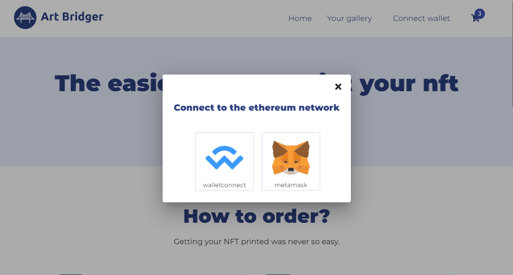
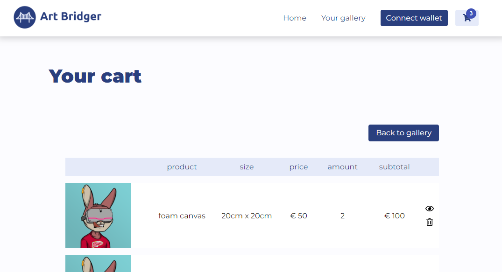
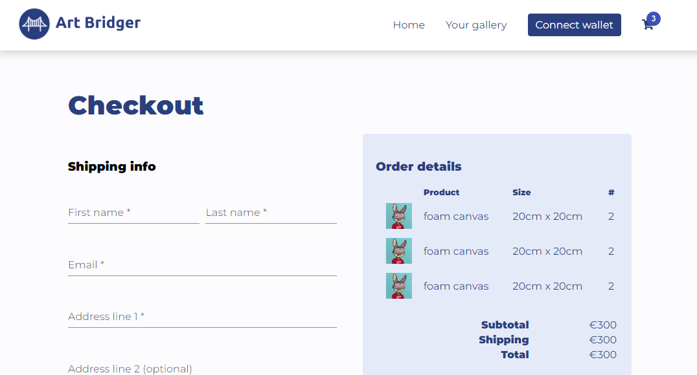

*Note: While this project was initially developed within a private repository, it has been made public for demonstration purposes.*

 

  <h2 align="center">ArtBridger: Bridging Digital Art to the Physical World through NFTs</h2>
  

    Welcome to the ArtBridger GitHub repository! ArtBridger is a captivating web application that aims to connect the fascinating world of NFTs (Non-Fungible Tokens) with the tangible realm of physical art. This project was created as a hobby project out of a fascination for NFTs and the desire to explore their technical intricacies.
  

## Built With
-   Angular 12.2.0
-   Moralis 0.0.98
-   Typescript 4.3.5

## How It Works
ArtBridger functions as a platform where users can seamlessly transform their cherished NFTs into physical art pieces. The process involves:

1.   **Connecting the Wallet**: Users can connect their digital wallets to ArtBridger, enabling easy access to their NFT collections.

2.   **Selecting NFTs**: Once the wallet is connected, users can explore their NFT inventory and choose the digital artworks they wish to bring into the physical world.

3.   **Customizing Canvas**: ArtBridger offers a range of canvas types and sizes. Users can select the canvas that best complements the essence of their chosen NFT.

4.   **Cart and Checkout**: A user-friendly cart and checkout system simplifies the ordering process, ensuring a smooth transition from the digital to the physical realm.

## Screenshots

## Future steps
While this project began as a passionate hobby, it stemmed from a deep curiosity about NFTs. As we look towards the future, several intriguing avenues for development come to mind:

-   **Validation and Certification**: One intriguing prospect is the integration of a robust validation system that affirms the identity of the individual placing an order for a printed NFT. This validation could be achieved through ArtBridger's own certification mechanism, underscoring the tangible connection between the digital NFT and its physical rendition. Alternatively, a novel NFT could be generated upon the successful completion of the checkout process, attesting to the ownership of the printed artwork.

-   **Third-Party Fulfillment Integration**: Expanding the project's horizons, the incorporation of a third-party entity for order fulfillment presents an exciting opportunity. By collaborating with a reliable third party, the printing and delivery process could be streamlined, ensuring a seamless experience for users as their digital art takes on a tangible form.
